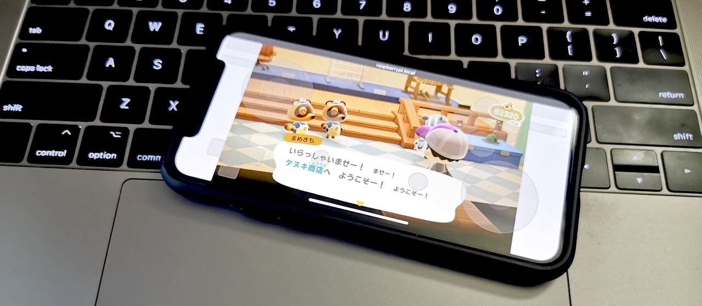

# ns-remote

Play Nintendo Switch anyware



## Requirements

- Nintendo Switch
- Nintendo Switch Dock
- HDMI Cable
- Raspberry Pi 4 Model B
- [H2C-RPI-B01] or [B101]
- USB 3.0 A to C Cable
- Powered USB 3.0 Hub [^1]

[H2C-RPI-B01]: https://mzyy94.com/blog/2020/04/10/raspberrypi-hdmi-input/#h2c-rpi-b01
[B101]: https://auvidea.eu/b101-hdmi-to-csi-2-bridge-15-pin-fpc/

## Pi Setup

### config.txt

Put these line into /boot/config.txt on Raspbian.

```
dtoverlay=dwc2
dtoverlay=tc358743
```

### /etc/modules

Put these line into /etc/modules on Raspbian.

```
dwc2
libcomposite
```

### H2C-RPI-B01 Board

Connect H2C-RPI-B01 board to Raspberry Pi and run the following command (every time before launch).

```
v4l2-ctl --set-edid=file=720P30EDID.txt
v4l2-ctl --set-dv-bt-timings query
```

See [HDMI入力をRaspberry Piで駆使する - 犬アイコンのみっきー](https://mzyy94.com/blog/2020/04/10/raspberrypi-hdmi-input/#%E3%82%AD%E3%83%A3%E3%83%97%E3%83%81%E3%83%A3%E3%83%BC%E3%83%9C%E3%83%BC%E3%83%89) for more details.

### Add Pro Controller USB Gadget with UAC Audio

Run [procon_audio.sh](https://gist.github.com/mzyy94/02bcd9d843c77896803c4cd0c4d9b640#file-procon_audio-sh) with `sudo` (every time after reboot).

For more details, see links below
- [UAC GadgetでNintendo Switchの音声出力をRaspberry Piに取り込む - 犬アイコンのみっきー](https://mzyy94.com/blog/2020/04/17/nintendo-switch-audio-uac-gadget/#pro-controller--uac)
- [スマホでNintendo Switchを操作する 〜 USB GadgetでPro Controllerをシミュレート 〜 - 犬アイコンのみっきー](https://mzyy94.com/blog/2020/03/20/nintendo-switch-pro-controller-usb-gadget/#usb-gadget%E3%81%A7hid%E3%82%B7%E3%83%9F%E3%83%A5%E3%83%AC%E3%83%BC%E3%83%88%E5%AE%9F%E9%A8%93)

## Build

```sh
go build
```

## Launch

```
sudo ./ns-remote
```

Open http://raspberrypi.local:8000 on your smart phone.

### Launch with specific device

Find your audio/video capture device with `v4l2-ctl --list-devices` and `arecord -l`. And specify the devices to an argument.

For example,

```
sudo ./ns-remote -audio hw:1,0 -video /dev/video1
```


## Limitations

- Wake-up is not supported yet

## License

[GPL v3](LICENSE)
